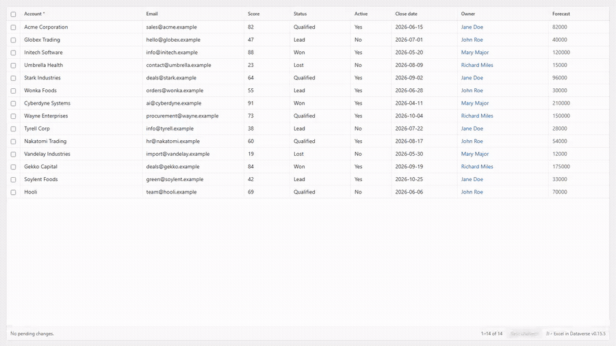

<div align="center">

# JJ - Excel in Dataverse

### The spreadsheet experience Dataverse always should have had - edit your records inline, right inside the Model-Driven App.

[](LICENSE)
[](https://learn.microsoft.com/power-apps/developer/component-framework/overview)
[](CONTRIBUTING.md)
[](https://www.linkedin.com/in/jeroen-jonckheer/)



*Type in cells, edit several rows at once, paste straight from Excel, pick lookups as you type - all saved to Dataverse, no export required.*

A spreadsheet-style **dataset control** for Microsoft Dynamics 365 / Dataverse, built as a
**PCF (Power Apps Component Framework)** control. Bind it to any view or subgrid and your users
get the fast, familiar grid they keep escaping to Excel for - without ever leaving the app.

</div>

## Why

**This is how you win the Excel-addicted user over to Dynamics.**

Every Dynamics 365 / Dataverse rollout hits the same wall: a group of users who keep living in Excel.
They export, edit there, and import back - or never come into the app at all - because the standard
grid does not feel like the tool they are fast in. You cannot argue them out of Excel; you have to
give them Excel *inside* Dynamics. That is exactly what this control does.

The single most important feature for that is **paste from Excel**. The day a power user can select
a block in their spreadsheet, paste it straight onto a Dataverse view, and have it saved - lookups
resolved by name, new rows created, validation applied - is the day they stop maintaining a shadow
copy in Excel. Combined with inline editing, fill-handle series, copy back to Excel and undo/redo,
the moment a user thinks "let me just export this to Excel" the application has already lost - and
this control makes sure that thought never comes up.

The reason was always the grid experience, not Dataverse itself. Bring the spreadsheet in, and the
data finally lives where it belongs.

## What it does

A condensed overview - see [Features](#features) below for the full list.

- **Paste straight from Excel** across cells and rows - the key feature: lookups resolve by name,
  rows past the end are created, and everything is validated and saved to Dataverse.
- **Inline editing** of every common column type, with keyboard navigation that matches a
  spreadsheet.
- **Rectangular selection**, copy as Excel-ready text, and a **fill handle** to extend a series.
- **Move a block** of cells by dragging its border, like Excel.
- **Find & replace** across the loaded grid, with match-case and whole-cell options.
- **Undo and redo** (Ctrl+Z / Ctrl+Y) for edits, deletes, pastes and moves.
- **Column layout** straight from the view: reorder, resize, auto-fit, freeze and sort.
- **Metadata-driven validation** before save, with server-side rejections shown on the right row.
- Built to **stay responsive and self-heal** on large or externally changed datasets.
- A calm, standard Dynamics 365 look: the same font and sizing, a white editing background and
  the control version in the footer.

## Who it is for

Makers and administrators who manage Dataverse data in Model-Driven Apps and want a faster, in-app
way to edit lists - bulk updates, data clean-up, quick triage - without exporting to Excel.

## Install

### Option A - import the ready-made solution (no build)

1. Download `JJExcelInDataverse_managed.zip` from the [latest release](../../releases/latest).
2. Import it: **make.powerapps.com -> Solutions -> Import solution**, or with the Power Platform CLI:
   ```bash
   pac auth create --url https://YOURORG.crm.dynamics.com
   pac solution import --path JJExcelInDataverse_managed.zip --publish-changes
   ```
3. Add **JJ - Excel in Dataverse** to a view or subgrid (see Configuration).

### Option B - build from source

Requires [Node.js](https://nodejs.org), the [.NET SDK](https://dotnet.microsoft.com) and the
[Power Platform CLI](https://aka.ms/PowerPlatformCLI) (`pac`).

```bash
npm install
npm run build                                                       # build the control
dotnet build solution/JJExcelInDataverseSolution.cdsproj -c Release # build the managed solution
pac solution import --path solution/bin/Release/JJExcelInDataverseSolution.zip --publish-changes
```

The control uses the host-provided **React 16** and **Fluent UI 9** platform libraries.

## Configuration

JJ - Excel in Dataverse is a **dataset** control, so it replaces the grid of a view or subgrid.

1. Open the classic form, view or dashboard designer.
2. Select the **subgrid / list** you want to turn into a spreadsheet.
3. Open its properties -> **Controls** tab -> **Add control...** -> choose **JJ - Excel in Dataverse**.
4. Enable it for **Web, Phone and Tablet**.
5. **Save & Publish.**

The columns come from the view metadata, so you arrange the columns by editing the view itself.
There is one optional property, `pageSize`, controlling how many records load at once (default 100).

## Features

### Inline editing

- **Edit every common column type in place:** text and multiline text, whole number, decimal,
  currency and floating point, date and date/time, choice (option set), Yes/No (boolean) and simple
  lookups.
- **Choice and Yes/No** columns edit with a native dropdown (with its caret) that opens on a single
  click, so the browser positions the list correctly.
- **Lookups** offer type-ahead autocomplete: start typing to search the target table and pick an
  existing record. A lookup value renders as a Dataverse-style link (blue, underlined on hover);
  click it to open the referenced record.
- **Calculated, rollup and other server-computed columns** are detected from metadata and shown
  read-only rather than offered for editing.

### Keyboard and navigation

- **Move** between cells with the arrow keys; **Tab / Shift+Tab** step to the next / previous cell
  and wrap across rows; **Enter / Shift+Enter** move down / up.
- **Enter** or **F2** starts editing the selected cell; just **start typing** to replace its
  contents.
- **Escape** cancels the current edit; **Delete / Backspace** clears the selected cell(s).

### Selection, copy and paste

- **Rectangular selection** with Shift+click, Shift+Arrow or a mouse drag, with an Excel-style
  status-bar summary in the footer (cell **count**, plus **sum** and **average** of the numeric
  cells).
- **Ctrl+C** copies the range as both tab-separated text and an HTML table, so it pastes straight
  into Excel or back into the grid; the copied range shows Excel's animated "marching ants" marquee
  until you paste or press Escape.
- **Paste from Excel** across many cells and rows at once. The clipboard's HTML table is used when
  present (robust to Protected View and copy paths that drop row separators), with plain-text
  fallbacks; a paste that runs past the end of the grid **adds new rows** instead of dropping data.
- **Lookup resolution on paste:** pasted text is matched to a record by primary name (trimmed,
  case-insensitive) or by GUID; no match or several matches mark the cell invalid. Repeated values
  are resolved once and cached, so large pastes stay fast.
- **Fill handle:** drag the small square at the bottom-right of the selection to fill the column -
  numbers extrapolate as a series (a single number copies), other column types repeat the selected
  values; the outline grows to frame the whole series like Excel.
- **Move a block** by dragging the border of a multi-cell selection (the cursor turns into a move
  cursor); a dashed preview shows where it lands, the values move there and the source clears.
  Read-only or out-of-grid target cells are left untouched, and the move is a single undo step.
- **Delete / Backspace** clears every editable cell in the selection.

### Find and replace

- **Ctrl+F** opens a find bar (top-right); **Ctrl+H** opens it with replace; **Esc** closes it.
- Matches are highlighted and navigable with **Enter / Shift+Enter**, with **match-case** and
  **whole-cell** options.
- **Replace** and **Replace all** write pending edits (saved and undoable like any edit); read-only
  and lookup cells are found but not replaced.

### Rows

- **Add rows** by scrolling past the bottom or pressing the down arrow on the last row; they are
  created in Dataverse on save (an untouched empty row is ignored).
- New rows show the **default values** from the column metadata (choice and Yes/No); the server
  applies them on create.
- **Duplicate row** from the right-click menu starts a new, unsaved row pre-filled with the source
  row's editable values.
- **Select rows** with the leading checkbox column (Shift+click selects a whole range; the header
  checkbox selects all) and **delete** them via the footer button or the right-click menu - new
  rows drop immediately, saved records are removed on save (and Ctrl+Z reverts the mark).
- **Double-click** a row to open the record; right-click offers **Open record** and **Delete**.

### Columns and layout

- **Sort** by clicking a column header (server-side via the dataset, so it respects the view filter
  and works on large datasets).
- **Resize** a column by dragging the right edge of its header; **double-click** that edge to
  **auto-fit** it to the header and visible cell contents.
- **Reorder** columns by dragging a header onto another (a blue line marks where it lands); the new
  order flows through cells, widths, paste and navigation.
- **Freeze (pin) columns:** hover a header and click the pin to keep all columns up to and including
  it (plus the row checkboxes) in view while scrolling horizontally; click again to unfreeze
  (nothing is frozen by default, and reordering clears the freeze).
- **Column widths follow the view:** each column uses its configured pixel width and the grid
  scrolls horizontally when they do not fit; when there is room to spare the columns stretch
  proportionally to fill the width, the way the standard Dynamics grid does.
- The grid's **columns and filter come straight from the bound view**; changing the view, its
  layout or its filter is reflected in the grid.

### Undo and redo

- **Ctrl+Z / Ctrl+Y** (or Ctrl+Shift+Z) undo and redo edits, deletes, pastes and moves. A paste is
  a single step, and undoing a paste also removes any rows it created.

### Validation and saving

- **Metadata-driven validation:** required level, maximum length, numeric minimum, maximum and
  precision, email, phone and URL formats, choice options and lookup references. Nothing is invented
  beyond what the column metadata provides.
- **Required-on-new-row** is checked before a new row is sent, so an empty required field is blocked
  inline instead of failing at the server.
- **Save to Dataverse** is gated by a blocking per-cell validation pass; an edit that returns a cell
  to its original saved value drops out as a no-op.
- **Server-side rejections** (business rules, plugins, duplicate detection) are shown inline on the
  affected row, while your other changes are kept so you can fix and retry.

### Performance and resilience

- **"Load more" paging** matching the Dataverse dataset: it accumulates the loaded set rather than
  switching pages, and the footer reads **1-N of Total** (always shown, with the Load more button
  appearing only while more can be loaded). The batch size comes from the maker's **Page size**
  property.
- **Row virtualization** for large grids renders only the rows around the viewport (plus overscan),
  so a big page size or a large paste stays responsive; small grids render in full.
- **Self-heal:** when records are deleted outside the control, the grid re-queries from the first
  page instead of showing ghost rows; a guard prevents a refresh loop.
- **Transient-error retry** on reads, updates and deletes (with a short backoff); create is never
  retried, so a lost response cannot duplicate a record.
- **Batched, cached metadata enrichment** - at most one request per attribute type regardless of how
  many columns the view has.
- An **error boundary** around the grid shows an inline message with a Reload button instead of
  blanking the control to a white screen.

### Look and feel

- A standard Dynamics 365 look: Segoe UI, neutral colors, a white (#ffffff) editing background, and
  the control version shown in the footer (bumped on every deployed build).

## Documentation

Full documentation lives in the [project wiki](../../wiki) and, as a backup, under [docs/](docs).

## Customization and commercial support

JJ - Excel in Dataverse is free and open source (MIT). Need it tailored to your organisation - extra
column types, bespoke behaviour, a configuration UI, or integration with your processes? I take on
paid customization and support.

**Jeroen Jonckheer** - [LinkedIn](https://www.linkedin.com/in/jeroen-jonckheer/) - [GitHub](https://github.com/JeroenJonckheer)

## Contributing

Issues and pull requests are welcome - see [CONTRIBUTING.md](CONTRIBUTING.md).

## License

[MIT](LICENSE) (c) 2026 Jeroen Jonckheer
